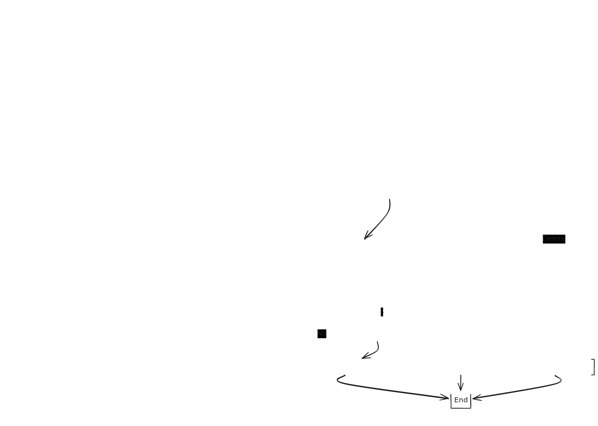

# Todo App

A simple fullstack Todo application built with a TypeScript-based frontend and backend, demonstrating best practices such as TDD, separation of concerns, and a functional core with an imperative shell.

## Repository Structure

```
├── frontend/
│   ├── index.html
│   ├── src/
│   │   ├── index.ts
│   │   ├── todo.ts
│   │   ├── utils.ts
│   │   └── utils.test.ts
│   ├── dist/
│   ├── package.json
│   └── tsconfig.json
├── backend/
│   ├── src/
│   │   ├── core/
│   │   │   ├── routes.ts
│   │   │   ├── todos.ts
│   │   │   ├── todos.test.ts
│   │   │   ├── api-validation.ts
│   │   │   └── api-validation.test.ts
│   │   └── index.ts
│   ├── package.json
│   └── tsconfig.json
└── README.md
```

## Big Picture Plan



## Planning Board

[View Planning Board](https://github.com/orgs/saltsthlm/projects/118/views/1)

## Project Overview

The Todo app is designed to separate concerns effectively, maintaining a clean architecture:

- **Frontend**: Built with TypeScript, the frontend consists of a form (`index.html`) for adding todos, managed by TypeScript (`index.ts`, `todo.ts`). Utility functions are also separated (`utils.ts`) with unit tests (`utils.test.ts`) to ensure reliability.

- **Backend**: The backend is separated into a **functional core** and an **imperative shell**:

  - **Functional Core** (`todos.ts`, `api-validation.ts`): Contains all business logic, such as adding and removing todos and validating requests. These modules are unit-tested using TDD (`todos.test.ts`, `api-validation.test.ts`).
  - **Imperative Shell** (`index.ts`): Manages HTTP requests, invokes core functions, and handles side effects such as responding to client requests.

## New Technical Concepts

### Zod for Schema Validation

**Why Zod?**
Zod is a TypeScript-first schema validation library that allows defining schemas and validating input data easily. It improves type safety and helps ensure that data coming into the server is valid.

**Process and Insights**

- **Exploration**: I explored various schema validation libraries and chose Zod for its simplicity and popularity.
- **Implementation**: Integrated Zod into the backend to validate incoming requests for creating and deleting todos.

```typescript
import { z } from "zod";

const TodoSchema = z
  .object({
    title: z.string(),
    description: z.string().optional(),
  })
  .strict();

type Todo = z.infer<typeof TodoSchema>;

...

function validateBody(body: string): boolean {
  try {
    const potentialTodo = JSON.parse(body);
    const result = TodoSchema.safeParse(potentialTodo);
    return result.success;
  } catch (error) {
    console.error("Invalid JSON:", error);
  }
  return false;
}
```

**Benefits**: Zod's type-safe validation reduced the chances of runtime errors and improved code readability, making it easier to ensure the correctness of incoming data.

### Simplified Async Function for Handling Request Body

To simplify the handling of request bodies, I created an asynchronous function `getBody` that reads data from an incoming HTTP request. This function uses a `Promise` to accumulate data chunks and resolves once the request ends:

```typescript
async function getBody(req: http.IncomingMessage): Promise<string> {
  let body = "";
  return await new Promise((resolve) => {
    req.on("data", (chunk) => (body += chunk));
    req.on("end", () => resolve(body));
  });
}
```

**Process and Insights**

- **Exploration**: I initially used a callback-based approach to handle incoming data but found it difficult to read and maintain.
- **Implementation**: Replaced the callback-based approach with an async/await pattern using a `Promise` to make the code more readable and easier to follow.
- **Benefits**: The new async function is much cleaner, allowing better readability and maintainability, which ultimately reduces the likelihood of errors.

## Technologies Used

- **Frontend**: HTML, TypeScript, http-server, JSDOM
- **Backend**: Node.js, TypeScript, Zod
- **Testing**: node runner
- **Planning**: GitHub Projects

## Project Choices and Rationale

1. **Functional Core and Imperative Shell**: This architecture helps maintain a clean separation between business logic and side effects, making the code more testable and reusable.
2. **TDD Approach**: Writing tests before implementing the functional core ensures reliability and reduces bugs early in the development process.
3. **Frontend Simplicity**: The frontend is kept minimal, simply triggering requests to the backend and rendering results. This keeps all critical logic server-side, ensuring a secure and centralized flow.

## How to Run the Project

1. **Clone the Repository**

   ```bash
   git clone https://github.com/your-username/your-repo.git
   ```

2. **Install Dependencies**

   - **Frontend**:
     ```bash
     cd frontend
     npm install
     ```
   - **Backend**:
     ```bash
     cd ../backend
     npm install
     ```

3. **Run the Backend**

   ```bash
   npm run start
   ```

4. **Open the Frontend**

   - Open **localhost:8080** in your browser.
